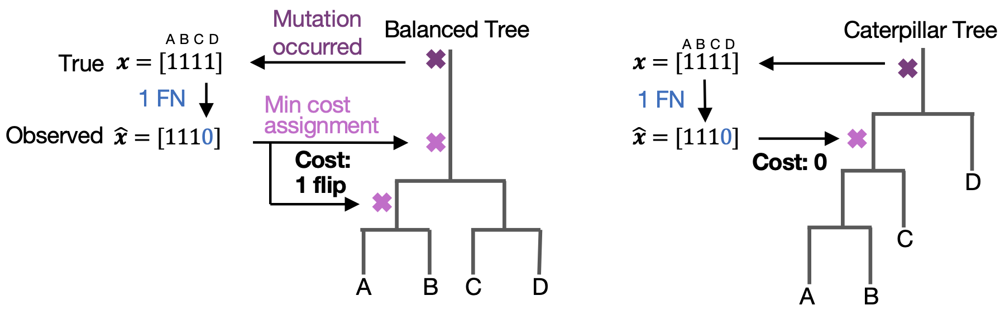

# Statistical Inconsistency of Error-Correction Objectives for Perfect Phylogenies


This repository reproduces the analyses and figures from the paper "Statistical Inconsistency of Error-Correction Objectives for Perfect Phylogenies" by Gryte Satas, Matthew A. Myers, and Sohrab P. Shah. A preprint will be available soon. 

The paper studies whether flip-based perfect phylogeny objectives recover the true tree in the presence of observation error. It shows that these objectives are statistically inconsistent for any positive error rates: there may exist a tree with a lower expected value than the true tree. Beyond the theoretical results, the paper uses computational analyses to study how large this effect can be in practice, how it depends on tree size and edge-length regimes, and which alternative topologies are favored when inconsistency occurs. This repository reproduces those computational analyses and figure panels, with a particular emphasis on constrained edge-length settings and realistic error rates motivated by single-cell DNA sequencing data.

## Notes

- The [notebooks](notebooks) directory is the main entry point to all analyses.
- Each analysis is practical to run locally on a laptop. The edge-length sampling notebook should take under 40 minutes, and the other analyses under 5 minutes each.
    - To quickly explore edge length sampling results, run analysis with lower $n$ (e.g., $n=50$ instead of the full $n=500$)
- Analyses only need to be run once. Intermediate results are cached in [cached_data](cached_data), so rerunning the notebooks will reuse saved results rather than recomputing the expensive steps, unless a recompute is specified
- Figures will be displayed in the notebooks, as well as exported as multi-page PDFs for each notebook

## Install

Create an environment and install the Python dependencies:

```bash
conda env create -f environment.yml
conda activate inconsistency-repo
```
## Repository Layout

- [notebooks](notebooks): primary analysis and figure-generation entry points
- [src](src): reusable code shared across notebooks and analyses
- [cached_data](cached_data): cached intermediate results used by the notebooks
- [figures](figures): exported figures and PDFs

## Analysis Notebooks

The intended analysis entry points are:

1. Equal weights analyses  
   Notebook: [notebooks/Equal_edge_lengths.ipynb](notebooks/Equal_edge_lengths.ipynb)  
   Recreates panels Figure 4. Also includes a plot of heatmaps for all n (expanding Fig. 4B)  
   Produces: `figures/Equal_edge_lengths.pdf`

2. Edge-length sampling analyses  
   Notebook: [notebooks/NNI_neighbors.ipynb](notebooks/NNI_neighbors.ipynb)  
   Recreates Figure 5, 6A, A1. Also includes scatter plots for all features (expanding Fig. A1E-G)  
   Produces: `figures/NNI_neighbors.pdf`

3. Caterpillar analyses  
   Notebook: [notebooks/Heuristic_caterpillar.ipynb](notebooks/Heuristic_caterpillar.ipynb)  
   Recreates Figure 6B. Compares the heuristic caterpillar to the true tree across tree sizes and RF distances.  
   Produces: `figures/Heuristic_caterpillar.pdf`

4. Algorithmic generation of inconsistent examples  
   Notebook: [notebooks/Counterexample_generator.ipynb](notebooks/Counterexample_generator.ipynb)  
   Generates inconsistent edge-weight distributions for random NNI neighbors via minimum-KL exponential tilts. Does not correspond to a figure in the paper.  
   Produces: `figures/counterexample_generator.pdf`  
